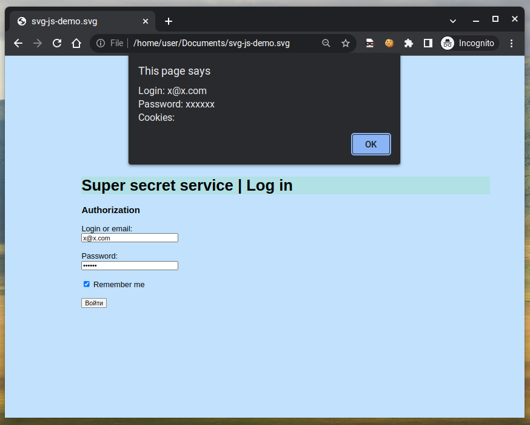

# Stored-XSS-via-SVG-file-upload
SVG image file with a fake login form and JavaScript code embedded inside it. When opened in a web browser, the JavaScript code will execute, allowing an attacker to steal user credentials. The project demonstrates how a malicious actor could exploit a poorly secured file upload form on a vulnerable website, using an SVG image file as an attack vector for stored cross-site scripting (XSS) or phishing attacks.

